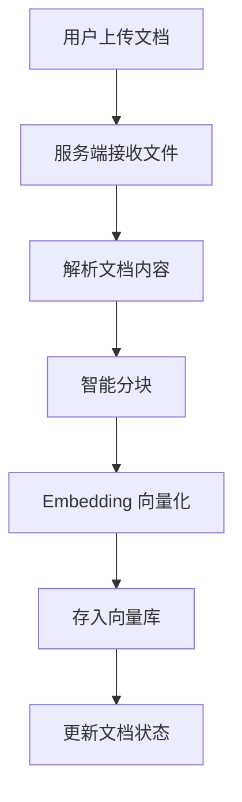
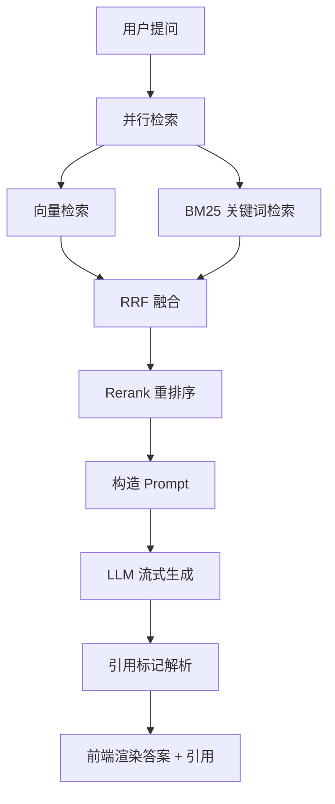
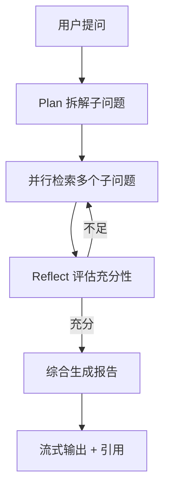

# NexusRAG 智能知识库 - 产品需求文档

## 1. 产品概述

NexusRAG 是一个面向求职展示的企业级 RAG（Retrieval-Augmented Generation）智能知识库系统，支持用户上传 PDF/Word/Markdown 文档，通过混合检索 + 引用溯源 + Agent 工作流模式，提供高质量、可溯源的问答能力。

- **目标用户**：求职者（用于简历展示）、技术面试官（用于评估）、个人知识管理爱好者
- **核心价值**：用 vibecoding 方式一次性交付一个具备真实技术深度的 AI 应用项目，作为 AI/大模型应用工程师岗位的核心作品

## 2. 核心功能

### 2.1 用户角色

| 角色 | 注册方式 | 核心权限 |
|------|---------|---------|
| 普通用户 | 邮箱注册 | 创建知识库、上传文档、对话问答、查看引用 |
| 访客（演示） | 免登录 | 体验预置知识库的对话功能 |

### 2.2 功能模块

1. **知识库管理页**：知识库 CRUD、文档上传与解析、文档列表
2. **对话问答页**：流式对话、引用溯源展示、Agent 模式切换
3. **首页**：项目介绍、核心特性展示、快速开始入口

### 2.3 页面详情

| 页面名称 | 模块名称 | 功能描述 |
|---------|---------|---------|
| 首页 | Hero 区 | 项目标题、slogan、CTA 按钮、动态背景 |
| 首页 | 特性卡 | 6 个核心特性卡片（混合检索/引用溯源/Agent/流式/多格式/工程化） |
| 首页 | 技术栈展示 | 可视化展示技术架构 |
| 知识库管理 | 知识库列表 | 卡片式展示、新建、删除、进入 |
| 知识库管理 | 文档上传 | 拖拽上传、支持 PDF/Word/MD/TXT |
| 知识库管理 | 文档列表 | 展示文档处理状态、分块数、向量数 |
| 对话问答 | 对话主区 | 流式输出、Markdown 渲染、代码高亮 |
| 对话问答 | 引用面板 | 侧滑展示引用来源、原文片段、文档页码 |
| 对话问答 | 模式切换 | 普通 RAG / Agent 深度研究 模式 |
| 对话问答 | 历史会话 | 左侧会话列表、多轮对话 |

## 3. 核心流程

### 3.1 文档入库流程

### 3.2 问答流程（普通 RAG 模式）

### 3.3 Agent 深度研究流程

## 4. 用户界面设计

### 4.1 设计风格

- **主色调**：深邃黑 (#0A0A0F) + 电光青 (#00D9FF) + 紫罗兰 (#9D4EDD) 渐变强调色
- **辅助色**：暖白 (#FAFAFA)、雾灰 (#1A1A24)
- **按钮**：圆角 (8px)、玻璃拟态 (backdrop-blur)、悬停光晕动效
- **字体**：标题用 'Space Grotesk' / 'Sora'；正文用 'JetBrains Mono' / 'Inter'
- **布局**：左侧固定导航栏 + 主内容区，对话页采用双栏（会话列表 + 对话区）
- **图标**：使用 lucide-vue-next
- **动效**：流式打字机、引用高亮、加载骨架、渐入动画

### 4.2 页面设计概览

| 页面名称 | 模块名称 | UI 元素 |
|---------|---------|---------|
| 首页 | Hero 区 | 全屏渐变背景 + 噪点纹理 + 大字标题 + CTA 按钮 |
| 首页 | 特性卡 | 6 张玻璃拟态卡片，悬停 3D 倾斜效果 |
| 知识库管理 | 列表 | 网格布局卡片，含图标/名称/文档数/更新时间 |
| 对话页 | 主对话区 | 居中布局，气泡式消息，引用标注可点击展开 |
| 对话页 | 引用侧滑 | 右侧滑出面板，原文带高亮 |

### 4.3 响应式

- 桌面优先（≥1280px 完整布局）
- 平板（768-1280px）折叠侧栏
- 移动端（<768px）单列布局，底部导航

### 4.4 3D 场景

不适用（无 3D 需求）
