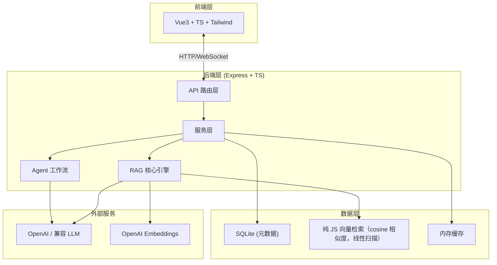
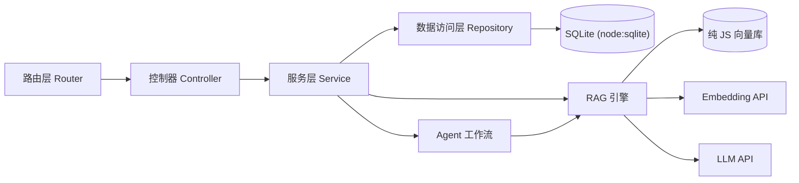
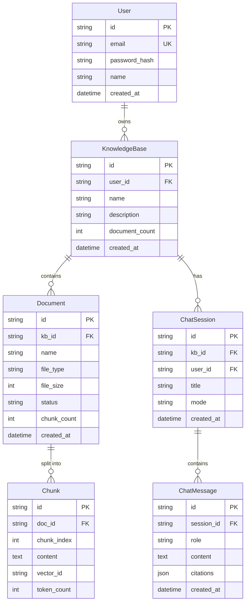

# NexusRAG 智能知识库 - 技术架构文档

## 1. 架构设计



## 2. 技术说明

### 前端
- **框架**：Vue 3.4 + TypeScript 5 + Vite 5
- **路由**：vue-router 4
- **样式**：Tailwind CSS 3 + 自定义 CSS 变量
- **状态**：Pinia
- **HTTP**：axios + 拦截器
- **UI 组件**：Naive UI（轻量、TypeScript 友好）
- **Markdown**：markdown-it + highlight.js + KaTeX
- **图标**：lucide-vue-next
- **流式**：XHR onprogress 渐进解析 SSE（兼容 webview；fetch + ReadableStream 在部分 webview 中会 ERR_ABORTED）

### 后端
- **框架**：Express 4 + TypeScript 5
- **路由**：express.Router 模块化
- **数据库**：SQLite (node:sqlite，Node 22+ 内置，无需原生编译)
- **向量库**：纯 JS 向量检索（cosine 相似度，线性扫描，文件持久化）
- **文档解析**：
  - PDF：pdf-parse
  - Word：mammoth
  - Markdown：marked
  - 纯文本：原生
- **LLM 调用**：openai SDK（兼容 OpenAI 协议的任意服务）
- **流式响应**：Server-Sent Events (SSE)
- **认证**：JWT (jsonwebtoken) + bcrypt
- **文件上传**：multer
- **校验**：zod

### 工程化
- **包管理**：pnpm（如可用）/ npm
- **代码规范**：ESLint + Prettier
- **测试**：Vitest（已配置）
- **构建**：Vite（前端）+ tsx（后端运行）

## 3. 路由定义

### 前端路由

| 路由 | 用途 |
|------|------|
| `/` | 首页（项目介绍） |
| `/login` | 登录注册 |
| `/dashboard` | 工作台（知识库列表） |
| `/kb/:id` | 知识库详情（文档管理） |
| `/chat/:kbId` | 对话页（指定知识库） |
| `/chat/:kbId/:sessionId` | 对话页（指定会话） |

## 4. API 定义

### 4.1 认证相关
```typescript
POST   /api/auth/register    // 注册
POST   /api/auth/login       // 登录
GET    /api/auth/me          // 获取当前用户
```

### 4.2 知识库
```typescript
GET    /api/kb               // 列表
POST   /api/kb               // 创建
DELETE /api/kb/:id           // 删除
GET    /api/kb/:id           // 详情
```

### 4.3 文档
```typescript
POST   /api/kb/:id/documents        // 上传文档（multipart）
GET    /api/kb/:id/documents         // 文档列表
DELETE /api/kb/:id/documents/:docId  // 删除文档
GET    /api/kb/:id/documents/:docId/status  // 处理状态
```

### 4.4 对话
```typescript
POST   /api/chat/:kbId/sessions        // 创建会话
GET    /api/chat/:kbId/sessions         // 会话列表
POST   /api/chat/:kbId/sessions/:sid/messages  // 发送消息（SSE 流式）
GET    /api/chat/:kbId/sessions/:sid/messages  // 消息历史
```

### 4.5 请求/响应 Schema 示例

```typescript
// 发送消息请求
interface ChatRequest {
  content: string;
  mode: 'normal' | 'agent';  // 普通 RAG / Agent 深度研究
  topK?: number;
}

// 流式响应（SSE 事件）
interface StreamChunk {
  type: 'token' | 'citation' | 'done' | 'error';
  data: {
    content?: string;          // 文本片段
    citations?: Citation[];   // 引用列表
    error?: string;
  };
}

interface Citation {
  id: number;
  docId: string;
  docName: string;
  content: string;     // 原文片段
  page?: number;       // 页码（PDF）
  score: number;       // 相关度
}
```

## 5. 服务器架构图



## 6. 数据模型

### 6.1 ER 图



### 6.2 DDL（SQLite）

```sql
CREATE TABLE IF NOT EXISTS users (
  id TEXT PRIMARY KEY,
  email TEXT UNIQUE NOT NULL,
  password_hash TEXT NOT NULL,
  name TEXT NOT NULL,
  created_at TEXT DEFAULT (datetime('now'))
);

CREATE TABLE IF NOT EXISTS knowledge_bases (
  id TEXT PRIMARY KEY,
  user_id TEXT NOT NULL REFERENCES users(id),
  name TEXT NOT NULL,
  description TEXT,
  document_count INTEGER DEFAULT 0,
  created_at TEXT DEFAULT (datetime('now'))
);

CREATE TABLE IF NOT EXISTS documents (
  id TEXT PRIMARY KEY,
  kb_id TEXT NOT NULL REFERENCES knowledge_bases(id) ON DELETE CASCADE,
  name TEXT NOT NULL,
  file_type TEXT NOT NULL,
  file_size INTEGER,
  status TEXT DEFAULT 'pending',
  chunk_count INTEGER DEFAULT 0,
  created_at TEXT DEFAULT (datetime('now'))
);

CREATE TABLE IF NOT EXISTS chunks (
  id TEXT PRIMARY KEY,
  doc_id TEXT NOT NULL REFERENCES documents(id) ON DELETE CASCADE,
  chunk_index INTEGER NOT NULL,
  content TEXT NOT NULL,
  vector_id TEXT NOT NULL,
  token_count INTEGER,
  metadata TEXT
);

CREATE TABLE IF NOT EXISTS chat_sessions (
  id TEXT PRIMARY KEY,
  kb_id TEXT NOT NULL REFERENCES knowledge_bases(id) ON DELETE CASCADE,
  user_id TEXT NOT NULL REFERENCES users(id),
  title TEXT,
  mode TEXT DEFAULT 'normal',
  created_at TEXT DEFAULT (datetime('now'))
);

CREATE TABLE IF NOT EXISTS chat_messages (
  id TEXT PRIMARY KEY,
  session_id TEXT NOT NULL REFERENCES chat_sessions(id) ON DELETE CASCADE,
  role TEXT NOT NULL,
  content TEXT NOT NULL,
  citations TEXT,
  created_at TEXT DEFAULT (datetime('now'))
);

CREATE INDEX IF NOT EXISTS idx_chunks_doc ON chunks(doc_id);
CREATE INDEX IF NOT EXISTS idx_documents_kb ON documents(kb_id);
CREATE INDEX IF NOT EXISTS idx_sessions_kb ON chat_sessions(kb_id);
CREATE INDEX IF NOT EXISTS idx_messages_session ON chat_messages(session_id);
```
