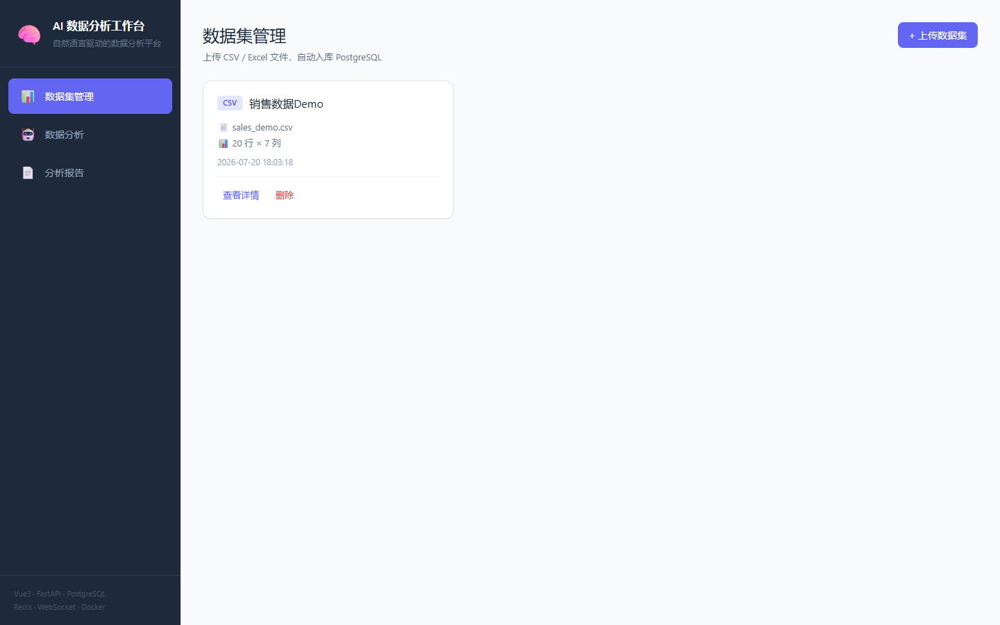
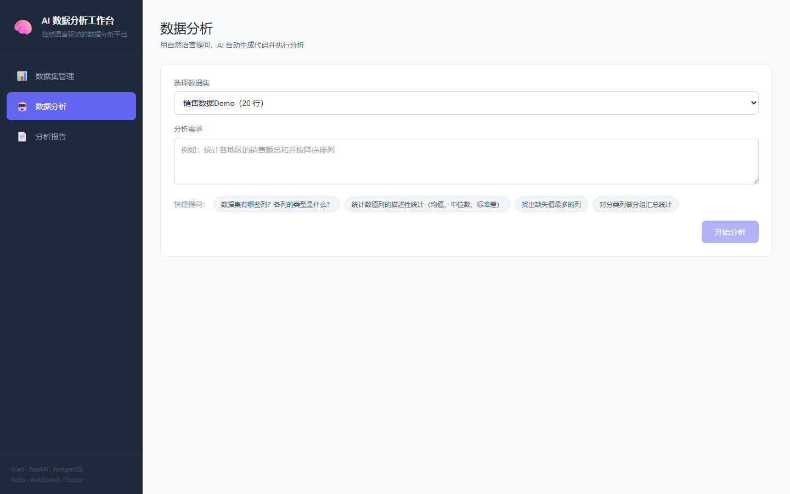
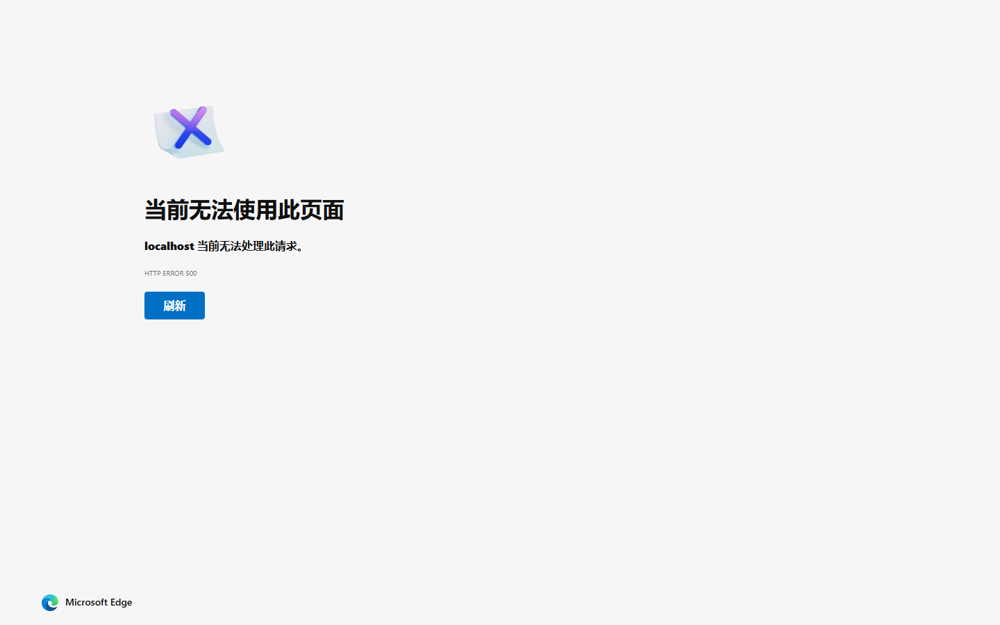

# 🧠 AI 数据分析工作台

> 一个用自然语言对话即可完成数据分析、可视化与报告生成的全栈 Web 应用。

上传 CSV / Excel 数据，用一句话描述分析需求，AI 自动生成 Pandas 代码并执行，实时推送进度，生成 ECharts 交互图表与 Matplotlib 服务端图表，最后一键导出 Markdown / PDF 分析报告。

---

## 📸 Demo 截图

### 数据集管理
上传 CSV / Excel 文件，自动入库 PostgreSQL，查看列信息与数据预览。



### 数据分析（核心）
选择数据集 → 自然语言提问 → 实时进度条 → 展示 ECharts 交互图表 + 数据表格 + 生成代码。



### 分析报告
自动生成 Markdown 报告，支持一键导出 PDF。



---

## ✨ 功能特性

| 模块 | 能力 |
|------|------|
| 📊 数据集管理 | 上传 CSV / Excel 文件，自动推断类型并入库 PostgreSQL，查看列信息与数据预览 |
| 🤖 自然语言分析 | 用一句话提问，LLM 生成 Pandas 代码并在沙箱中执行，返回结果与结论 |
| 📈 可视化 | 前端 ECharts 交互图表 + 服务端 Matplotlib/Seaborn 渲染 PNG，双引擎并存 |
| ⚡ 实时进度 | WebSocket + Redis Pub/Sub 实时推送分析进度（10% → 100%） |
| 📄 报告导出 | 自动生成 Markdown 分析报告，支持导出 PDF |
| 🐳 一键部署 | Docker Compose 编排五服务，一行命令启动 |

---

## 🏗️ 技术架构

```
┌─────────────────────────────────────────────────┐
│                   浏览器前端                      │
│        Vue3 + TypeScript + Vite + ECharts        │
└──────────────┬──────────────────────┬────────────┘
               │ HTTP (REST)          │ WebSocket
┌──────────────▼──────────────────────▼────────────┐
│                FastAPI 后端                        │
│   路由 / 服务 / LLM 调用 / 沙箱执行 / 图表渲染      │
└──────┬──────────────┬──────────────┬─────────────┘
       │              │              │
┌──────▼──────┐ ┌─────▼──────┐ ┌─────▼──────┐
│ PostgreSQL  │ │   Redis    │ │  Celery    │
│  数据存储    │ │ 缓存/消息   │ │  异步任务   │
└─────────────┘ └────────────┘ └────────────┘
```

**技术栈：**
- **前端**：Vue 3 · TypeScript · Vite · Pinia · Vue Router · ECharts · Tailwind CSS
- **后端**：FastAPI · SQLAlchemy · Pydantic · Celery
- **数据**：PostgreSQL · Redis
- **AI**：OpenAI 兼容 LLM 接口（支持 OpenAI / DeepSeek / 通义千问等）
- **可视化**：ECharts（前端）· Matplotlib / Seaborn（服务端）
- **报告**：Markdown · WeasyPrint (PDF)
- **部署**：Docker · Docker Compose

---

## 📁 项目结构

```
ai-analytics-workbench/
├── docker-compose.yml          # 一键编排：5 个服务
├── .env.example                # 环境变量模板
├── README.md
├── LICENSE
│
├── .github/workflows/          # CI（pytest + 前端测试）
│
├── backend/                    # FastAPI 后端
│   ├── Dockerfile
│   ├── requirements.txt
│   ├── alembic/                # 数据库迁移
│   ├── tests/                  # pytest 测试
│   └── app/
│       ├── main.py             # 应用入口（CORS / 静态文件 / 路由注册）
│       ├── config.py           # 配置管理（环境变量）
│       ├── celery_app.py       # Celery 异步任务
│       ├── api/                # 路由层
│       │   ├── router.py
│       │   ├── deps.py
│       │   └── routes/
│       │       ├── health.py
│       │       ├── datasets.py
│       │       ├── analysis.py
│       │       ├── reports.py
│       │       └── ws.py       # WebSocket 进度推送
│       ├── models/             # ORM 模型（Dataset / Analysis / Report）
│       ├── schemas/            # Pydantic 数据模型
│       ├── services/           # 业务逻辑层
│       │   ├── dataset_service.py    # 上传入库
│       │   ├── analysis_service.py   # LLM 调用 + 代码执行
│       │   └── report_service.py     # 报告生成 + PDF
│       ├── llm/                # LLM 客户端与提示词
│       ├── visualization/      # Matplotlib 图表渲染
│       ├── ws/                 # WebSocket 管理器 + Redis Pub/Sub
│       ├── utils/              # 数据工具（schema 推断 / 沙箱执行）
│       └── db/                 # 数据库会话与初始化
│
└── frontend/                   # Vue3 前端
    ├── Dockerfile
    ├── package.json
    ├── tests/                  # 前端测试（Vitest）
    └── src/
        ├── App.vue             # 侧边栏布局
        ├── router/
        ├── stores/             # Pinia（dataset / analysis）
        ├── api/                # HTTP 客户端 + WebSocket + 类型
        └── views/
            ├── DatasetsView.vue    # 数据集管理
            ├── AnalysisView.vue    # 分析对话（核心）
            └── ReportsView.vue     # 报告查看与导出
```

---

## 🚀 快速开始

### 方式一：Docker 一键启动（推荐）

```bash
# 1. 克隆项目
cd ai-analytics-workbench

# 2. 配置环境变量
cp .env.example .env
# 编辑 .env，填入你的 OPENAI_API_KEY

# 3. 一键启动所有服务
docker compose up -d --build

# 4. 访问应用
#    前端：http://localhost:5173
#    后端 API 文档：http://localhost:8000/docs
```

启动后，在浏览器打开 http://localhost:5173 即可使用。

### 方式二：本地开发

**后端：**
```bash
cd backend
python -m venv .venv
source .venv/bin/activate        # Windows: .venv\Scripts\activate
pip install -r requirements.txt

# 启动 PostgreSQL 与 Redis（可用 Docker）
docker run -d -p 5432:5432 -e POSTGRES_PASSWORD=analytics123 -e POSTGRES_USER=analytics -e POSTGRES_DB=analytics_workbench postgres:16-alpine
docker run -d -p 6379:6379 redis:7-alpine

# 初始化数据库
python -m app.db.init_db

# 启动后端
uvicorn app.main:app --reload --port 8000

# 另开终端启动 Celery Worker
celery -A app.celery_app worker --loglevel=info
```

**前端：**
```bash
cd frontend
npm install
npm run dev
```

---

## 🔑 环境变量

复制 `.env.example` 为 `.env` 并按需修改：

| 变量 | 说明 | 默认值 |
|------|------|--------|
| `OPENAI_API_KEY` | LLM API 密钥（必填） | - |
| `OPENAI_BASE_URL` | LLM 接口地址 | `https://api.openai.com/v1` |
| `LLM_MODEL` | 模型名称 | `gpt-4o-mini` |
| `POSTGRES_*` | PostgreSQL 连接信息 | analytics / analytics123 |
| `REDIS_HOST` | Redis 地址 | redis |
| `MAX_UPLOAD_SIZE_MB` | 上传大小限制 | 50 |
| `SANDBOX_TIMEOUT_SECONDS` | 沙箱墙钟超时（超时击杀整个进程树/容器，两种模式通用） | 30 |
| `SANDBOX_MODE` | 沙箱隔离模式：`subprocess`（默认）/ `docker` | subprocess |
| `SANDBOX_DOCKER_IMAGE` | docker 模式使用的镜像（本地缺失自动 pull，失败回退 subprocess） | python:3.12-alpine |

> 💡 支持 DeepSeek：将 `OPENAI_BASE_URL` 改为 `https://api.deepseek.com/v1`，`LLM_MODEL` 改为 `deepseek-chat`。

---

## 📖 使用指南

1. **上传数据**：进入「数据集管理」→ 点击「上传数据集」→ 选择 CSV/Excel 文件 → 系统自动入库并推断列类型
2. **数据分析**：进入「数据分析」→ 选择数据集 → 输入分析需求（如「统计各分类的销售额总和」）→ 点击「开始分析」
3. **查看进度**：页面实时显示分析进度条与阶段提示（加载→LLM 生成→执行→渲染）
4. **查看结果**：分析完成后展示结论摘要、ECharts 交互图表、Matplotlib 服务端图表、数据表格与生成代码
5. **生成报告**：点击「生成分析报告」→ 在「分析报告」页查看 Markdown 渲染 → 点击「导出 PDF」下载

### 示例提问

- 「数据集有哪些列？各列的缺失值情况如何？」
- 「统计数值列的均值、中位数、标准差」
- 「按分类列分组，计算每组的数量与平均值」
- 「找出销售额 Top 10 的记录」

---

## 🔌 API 接口

启动后访问 http://localhost:8000/docs 查看完整 Swagger 文档。

| 方法 | 路径 | 说明 |
|------|------|------|
| POST | `/api/v1/datasets/upload` | 上传数据集 |
| GET | `/api/v1/datasets` | 数据集列表 |
| GET | `/api/v1/datasets/{id}` | 数据集详情 |
| DELETE | `/api/v1/datasets/{id}` | 删除数据集 |
| POST | `/api/v1/analyses` | 创建分析任务 |
| GET | `/api/v1/analyses` | 分析任务列表 |
| GET | `/api/v1/analyses/{id}` | 分析任务详情 |
| POST | `/api/v1/reports` | 生成报告 |
| GET | `/api/v1/reports` | 报告列表 |
| POST | `/api/v1/reports/{id}/export-pdf` | 导出 PDF |
| WS | `/api/v1/ws/analysis/{id}` | 订阅分析进度 |

---

## 🎯 技术亮点

1. **LLM + 沙箱执行**：自然语言转 Pandas 代码，**三层防线**隔离执行（见下），安全可控
2. **双图表引擎**：前端 ECharts 交互探索 + 服务端 Matplotlib 静态渲染，兼顾灵活与可导出
3. **实时进度推送**：Celery Worker 异步执行 → Redis Pub/Sub → WebSocket 转发，全链路进度可见
4. **类型自动推断**：上传即推断列类型、空值数、唯一值数，LLM 据此生成精准代码
5. **容器化编排**：PostgreSQL / Redis / FastAPI / Celery / Nginx 五服务一键拉起

### 沙箱三层防线

用户代码不在主进程内联执行，而是经三道防线在一次性子进程中运行（`backend/app/utils/sandbox.py`）：

1. **AST 静态门**：启动子进程前零成本拒绝——拦截一切 `_` 开头属性访问（防 `df.__class__.__bases__...` 反射逃逸），pandas 危险 IO 黑名单（`read_pickle`/`read_stata` 禁用，`read_csv` 等读取器参数含 `://` 的 URL 拒绝）。
2. **子进程隔离**：以 `python -I` 隔离模式启动子进程（忽略环境变量与 PYTHONPATH、不加载用户 site-packages），环境变量仅透传白名单键（代理类变量一律剥离），包装脚本内重建受限 builtins 白名单后 exec 用户代码。
3. **墙钟超时击杀**：超过时限强制击杀整个进程树（Windows `taskkill /F /T`、POSIX 对独立进程组 SIGKILL），防止 fork 孤儿进程；临时目录无论成败最终删除。

> 平台限制（如实说明）：**Windows 无 setrlimit/seccomp**，CPU/内存约束由墙钟超时兜底（POSIX 分支尽力施加 RLIMIT_CPU/RLIMIT_AS）；网络不做硬隔离（已剥离代理变量 + URL 参数守卫收窄面）。超时时限由 `SANDBOX_TIMEOUT_SECONDS` 配置（默认 30s）。

### 沙箱隔离模式对照（SANDBOX_MODE）

`SANDBOX_MODE=subprocess`（默认）与 `SANDBOX_MODE=docker` 共享同一套 AST 门、pandas IO 黑名单、受限 builtins 与结果文件协议；区别在第二道隔离层：

| 维度 | subprocess（默认） | docker |
|------|-------------------|--------|
| 隔离边界 | 一次性子进程（`python -I` + 环境变量剥离） | 一次性容器（`--rm --network=none --memory=512m --cpus=1 --pids-limit=128`） |
| 网络 | **无硬隔离**：持有真实 socket 栈，仅守卫收窄面 | **硬隔离**：`--network=none`，容器无路由 |
| CPU / 内存 | POSIX rlimit 尽力而为；Windows 仅超时兜底 | cgroups 硬限，全平台一致 |
| 文件系统 | 宿主用户权限可见 | 仅临时工作目录挂载进出（`/work`） |
| 超时处置 | `taskkill /F /T` 或 killpg 整树击杀 | `docker kill` 击杀容器 |
| 依赖要求 | 无（复用后端 Python 环境） | 需要 Docker 引擎；默认 alpine 镜像缺 pandas 时首次自动装入持久依赖卷 |

- docker 模式下镜像本地不存在会自动 `docker pull`；引擎不可用、pull 失败或依赖准备失败时**自动回退 subprocess 并记录 warning**，业务不中断。
- 如实说明：Docker daemon 自身攻击面（socket 权限、镜像供应链）不在沙箱防护范围内。

---

## 📸 Demo 截图

> 以下截图需在项目运行后截取。启动项目后访问 http://localhost:5173 即可获取。

- 数据集管理页：上传与预览
- 数据分析页：自然语言提问 + 进度条 + 双图表 + 结果表格
- 分析报告页：Markdown 渲染 + PDF 导出

---

## 📄 License

MIT
